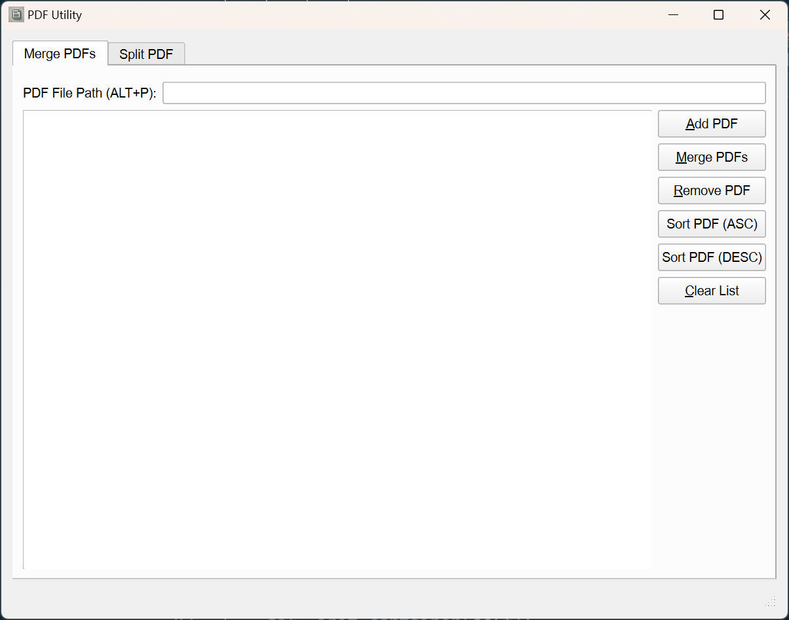
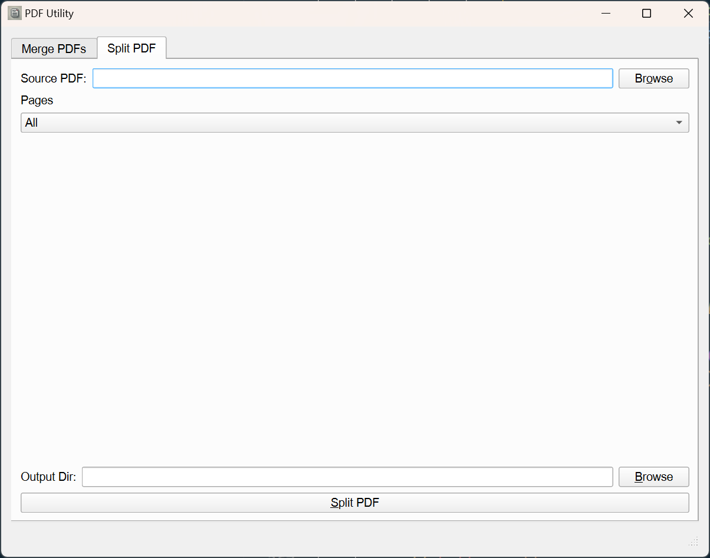
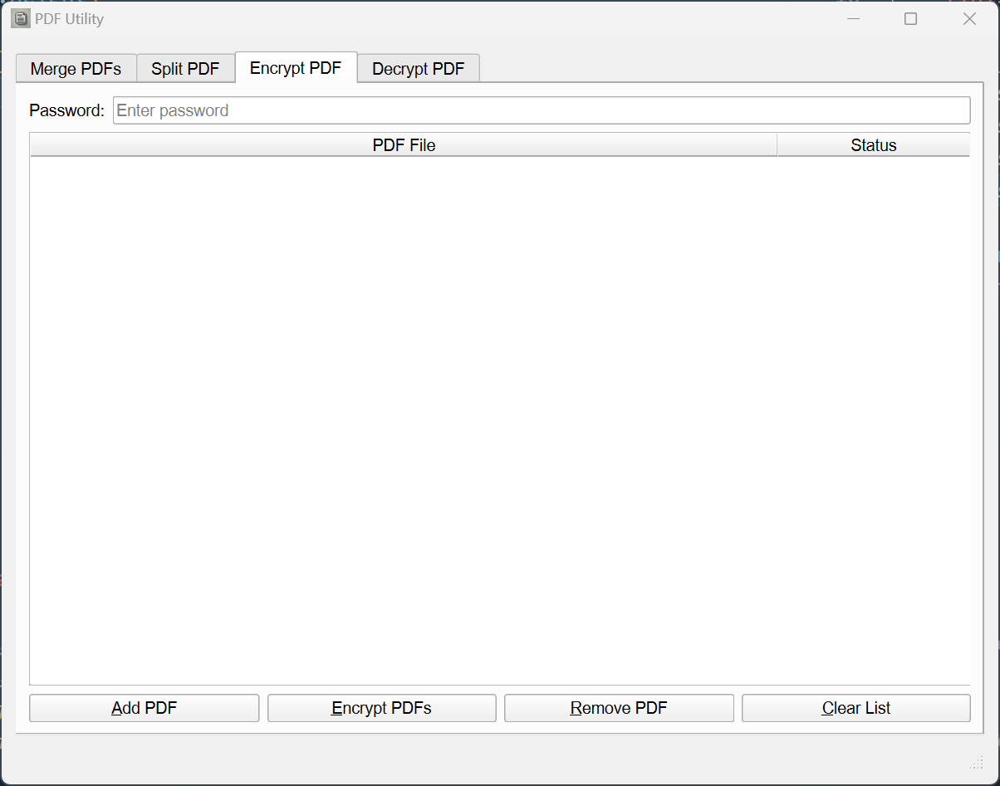
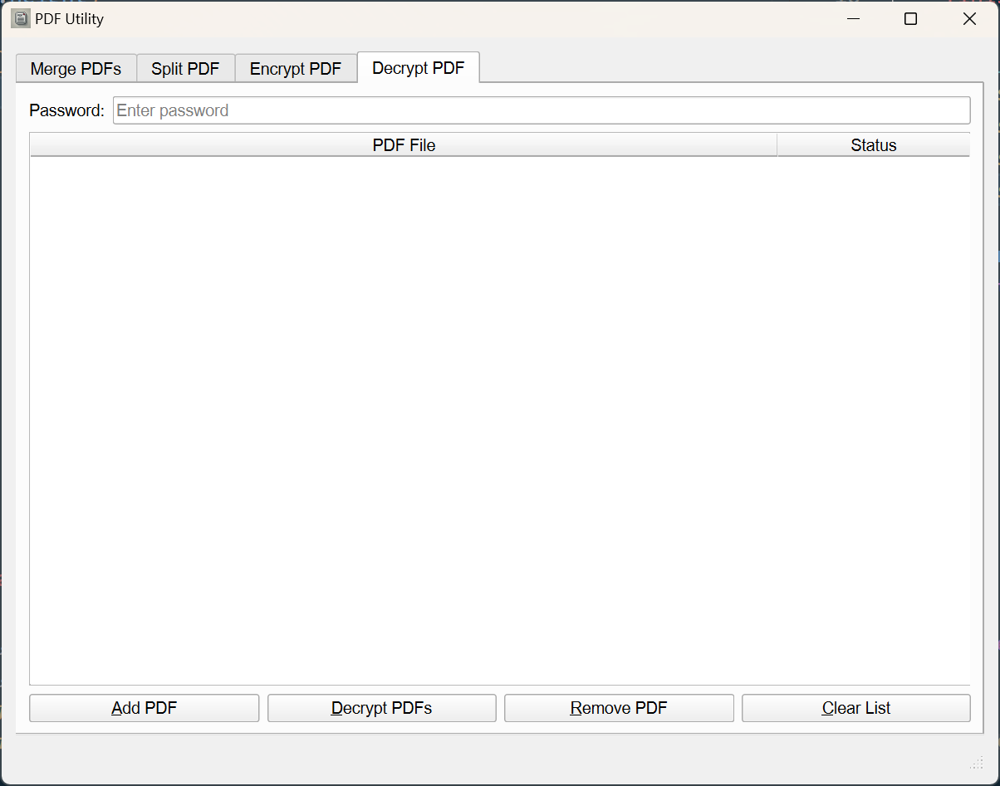

# Just a PDF Tool

## Description
This desktop app consists of two main scripts: `app.py` and `pdf_utility.py`. The purpose of these scripts is to provide utilities for handling PDF files, including operations such as merging, splitting, and extracting text from PDFs.









## Installation
To set up the project, follow these steps:

1. Clone the repository:
    ```sh
    git clone https://github.com/<your-username>/jj-pdf-utility.git
    ```

2. Create a virtual environment:
    ```sh
    python -m venv venv
    ```

3. Activate the virtual environment:
    - On Windows:
        ```sh
        venv\Scripts\activate
        ```
    - On macOS/Linux:
        ```sh
        source venv/bin/activate
        ```

4. Install the required dependencies:
    ```sh
    pip install -r requirements.txt
    ```


### app.py
This script serves as the main entry point for the PDF utility operations.

To run the script:
```sh
python app.py
```

## PDF ListWidget Functions To Add

- ~~PDFs drag and drop~~
- ~~PDF drag and reorder~~
- ~~Add PDFs file dialog~~
- ~~Prevent duplicate PDF files~~

## Feature To Add

- Convert PDF to Word
- Convert PDF to JPG
- Convert PDF to PNG
- ~~Split PDF~~
- ~~Merge PDF~~
- Compress PDF
- Watermark PDF
- Rotate PDF
- Encrypt/Decrypt PDF
- Sign PDF